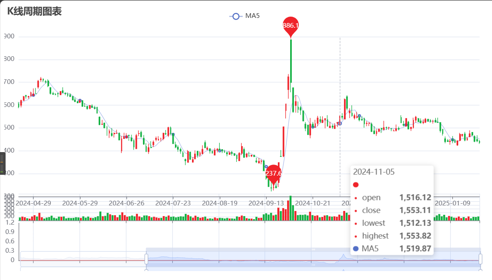

# 同花顺模拟炒股接口


## 介绍

用于量化策略的模拟盘实盘测试，通过构造post请求实现。

目前支持

* 查询当前账户的持仓、可用资金、当前委托情况
* 下单（买入、卖出、撤单）
* 查询全部委托订单
* 查询全部持仓信息
* 查询指定股票信息（当前价格、可买数量、市场代码、五档信息）
* 获取股票历史数据(efinance数据源)
* 绘制k线图

## 使用

* ThsDT.py主要是同花顺模拟炒股网页版的接口解析
* SourceEF.py主要是股票数据的获取和二次封装

### 下单操作

```py
ths = ThsDT()  # 实例化对象

cancel_all(ths)  # 撤销所有委托
ths.buy(stock_code='601988', price=5.41, amount=100)  # 以5.41的价格购买601988股票100股
ths.buy(stock_code='601988', amount=2600)  # 购买601988股票2600股，使用市场价
ths.sell(ths.get_chicang()[0], price=8.14, amount=200)  # 以8.14的价格出售第一个持仓，数量为200股
ths.sell(ths.get_chicang()[0], amount=200)  # 出售第一个持仓的200股，使用市场价
ths.cancel(ths.get_order()[0])  # 撤销第一个未完成的订单

print(ths.get_fund())  # 输出当前可用资金情况
print(ths.get_chicang())  # 输出当前持仓情况
print(ths.get_order())  # 输出当前委托情况
```

### 获取股票数据

```py
source = SourceEF()  # 实例化数据源对象

print(source.today)  # 打印最新交易日的日期
print(source.stock_df)  # 打印股票数据的DataFrame对象
print(source.stock_code_list)  # 打印全部股票代码列表
print(source.data_type)  # 打印数据包含的字段列表['股票代码', '股票名称', '涨跌幅', '最新价'...]
source.export_to_csv()  # 将数据导出为CSV文件
print(source.get_stock_data(stock_code='600519'))  # 以贵州茅台为例
print(source.get_stock_data(stock_code='600519', start_date='20250101', end_date='20250124'))  # 以贵州茅台为例
print(source.get_stock_data(stock_code='600519', start_date='20250101', end_date='20250124', klt=1))  # 以贵州茅台为例
print(source.get_stock_data(stock_code=source.stock_code_list[:15], start_date=20220815, end_date=20220815, klt=1))

# 一些自定义的筛选操作或量化策略
stock_code_set = set(filter_stocks_by_price_change(source.stock_df, min_change=3.0, max_change=5.0))
print(len(stock_code_set))
stock_code_set = stock_code_set & set(filter_stocks_by_volume_ratio(source.stock_df, min_ratio=1.0))
print(len(stock_code_set))
stock_code_set = stock_code_set & set(filter_stocks_by_turnover_rate(source.stock_df, min_rate=5.0, max_rate=10.0))
print(len(stock_code_set))
stock_code_set = stock_code_set & set(filter_stocks_by_market_cap(source.stock_df, min_cap=50e8))
print(len(stock_code_set))

# 打印筛选结果
for stock_code in stock_code_set:
    print(source.get_name_by_code(stock_code=stock_code))
for code in stock_code_set:
    mt = source.get_stock_data(stock_code=code, start_date='20250101', end_date='20250124')
    print(filter_stocks_by_cv(mt['成交量'], threshold=20.2))
    
# 然后可以实例化ThsDT对象，进行交易操作...
```

### plotK.py是一份绘制k线图的代码




